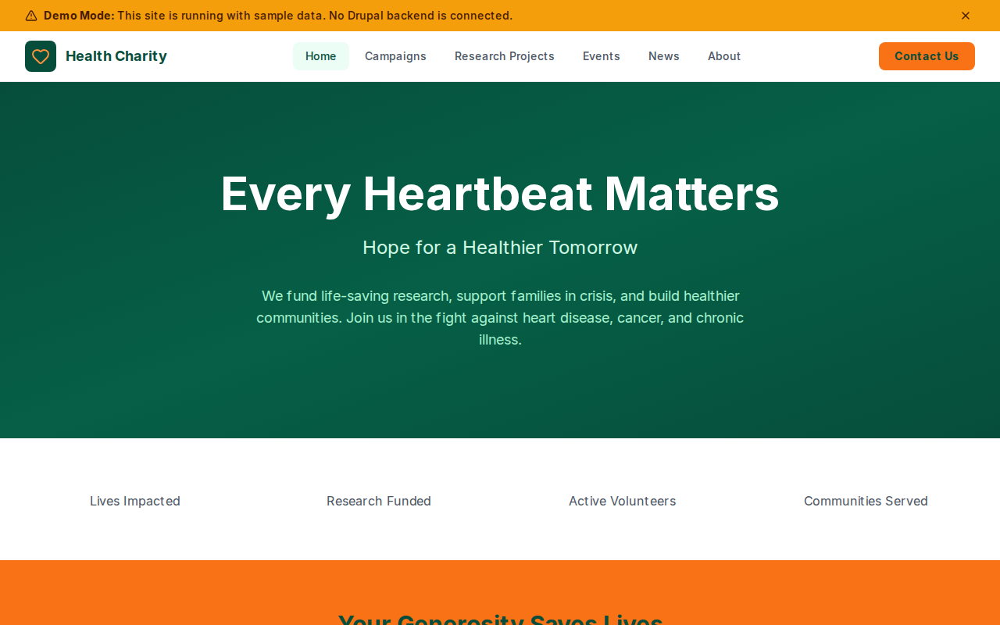

# Decoupled Health Charity

A health charity website built with Next.js and Decoupled Drupal, designed for health foundations, medical nonprofits, and charitable organizations to showcase campaigns, research, events, and news.



[](https://vercel.com/new/clone?repository-url=https://github.com/nicholasio/decoupled-health-charity&project-name=decoupled-health-charity)

## Features

- Browse fundraising and awareness **campaigns** with goals, progress tracking, and health areas
- Explore funded **research projects** with lead researchers, institutions, and funding details
- Discover charity **events** including galas, walks, screenings, and community health activities
- Read foundation **news** with categories and featured articles
- Dynamic homepage with hero section, impact statistics, and donation call-to-action
- Static **pages** for about and volunteer information

## Quick Start

### 1. Clone the template

```bash
npx degit nicholasio/decoupled-health-charity my-health-charity
cd my-health-charity
npm install
```

### 2. Run interactive setup

```bash
npm run setup
```

### 3. Start development

```bash
npm run dev
```

Visit [http://localhost:3000](http://localhost:3000)

---

## Manual Setup

<details>
<summary>Click to expand manual setup steps</summary>

### Authenticate with Decoupled.io

```bash
npx decoupled-cli@latest auth login
```

### Create a Drupal space

```bash
npx decoupled-cli@latest spaces create "Heart & Hope Health Foundation"
```

Note the space ID returned (e.g., `Space ID: 1234`). Wait ~90 seconds for provisioning.

### Configure environment

```bash
npx decoupled-cli@latest spaces env 1234 --write .env.local
```

### Import content

```bash
npm run setup-content
```

This imports the following sample content:

- **Campaigns:** Hearts for Hope ($2.5M goal, cardiac health), Childhood Cancer Warriors ($1.8M, oncology), Mind Matters Initiative ($750K, mental health), Step Up for Diabetes ($500K, community wellness)
- **Research Projects:** Regenerative Cardiac Tissue Therapy (Stanford, $2.4M), Next-Generation Pediatric Immunotherapy (Children's National, $1.8M), Genomic Approaches to Diabetes Prevention (Johns Hopkins, $1.5M)
- **Events:** Annual Hope Gala 2026, Heart & Hope 5K Walk/Run, Free Community Health Screening
- **News:** Foundation Receives $5M NIH Research Grant, 2025 Impact Report, Volunteer Spotlight
- **Pages:** About Heart & Hope Health Foundation, Volunteer With Us
- **Homepage:** Hero section, statistics (50,000+ Lives Impacted, $12M Research Funded, 3,200+ Active Volunteers, 85 Communities Served), and donation CTA

</details>

## Content Types

### Campaign

Fundraising and awareness campaigns for health causes.

| Field | Type | Description |
|-------|------|-------------|
| health_area | term(health_areas)[] | Health area this campaign supports |
| campaign_type | term(campaign_types)[] | Type of campaign (fundraising, awareness, etc.) |
| goal_amount | string | Campaign fundraising goal |
| raised_amount | string | Amount raised so far |
| deadline | datetime | Campaign end date |
| image | image | Campaign image |
| body | text | Full campaign description |

### Research Project

Funded research projects in health sciences.

| Field | Type | Description |
|-------|------|-------------|
| health_area | term(health_areas)[] | Health area of the research |
| lead_researcher | string | Name of the principal investigator |
| institution | string | Research institution or university |
| funding_amount | string | Total funding awarded |
| start_date | datetime | Research project start date |
| image | image | Project image |
| body | text | Full project description |

### Event

Charity events, galas, walks, and community health activities.

| Field | Type | Description |
|-------|------|-------------|
| event_date | datetime | Event start date and time |
| end_date | datetime | Event end date and time |
| location | string | Event venue |
| event_type | term(event_types)[] | Type of event |
| registration_url | string | Registration link |
| image | image | Event image |
| body | text | Full event description |

### News Article

Foundation news, announcements, and impact stories.

| Field | Type | Description |
|-------|------|-------------|
| image | image | Featured image |
| category | term(news_categories)[] | News category |
| featured | bool | Whether this is a featured article |
| body | text | Full article content |

### Homepage

Landing page with hero section, impact statistics, and call-to-action areas.

| Field | Type | Description |
|-------|------|-------------|
| hero_title | string | Hero headline |
| hero_subtitle | string | Hero subheading |
| hero_description | text | Hero body text |
| stats_items | paragraph(stat_item)[] | Key foundation statistics |
| featured_campaigns_title | string | Featured campaigns section title |
| cta_title | string | CTA section title |
| cta_description | text | CTA body text |
| cta_primary | string | Primary button label |
| cta_secondary | string | Secondary button label |

### Basic Page

Static content pages for about, volunteer, policies, etc.

| Field | Type | Description |
|-------|------|-------------|
| body | text | Page content |

## Customization

### Colors & Branding

Edit `tailwind.config.js` to customize colors, fonts, and spacing for your foundation's brand.

### Content Structure

Modify `data/health-charity-content.json` to update campaigns, research projects, events, and other sample content.

### Components

React components are in `app/components/`. Update them to match your health charity's design and mission.

## Demo Mode

### Enable Demo Mode

Set the environment variable:

```bash
NEXT_PUBLIC_DEMO_MODE=true
```

Or add to `.env.local`:

```
NEXT_PUBLIC_DEMO_MODE=true
```

### What Demo Mode Does

- Shows a "Demo Mode" banner at the top of the page
- Returns mock data for all GraphQL queries
- Displays sample campaigns, research projects, events, and news
- No Drupal backend required

### Removing Demo Mode

To convert to a production app with real data:

1. Delete `lib/demo-mode.ts`
2. Delete `data/mock/` directory
3. Delete `app/components/DemoModeBanner.tsx`
4. Remove `DemoModeBanner` from `app/layout.tsx`
5. Remove demo mode checks from `app/api/graphql/route.ts`

## Deployment

### Vercel (Recommended)

[](https://vercel.com/new/clone?repository-url=https://github.com/nicholasio/decoupled-health-charity)

Set `NEXT_PUBLIC_DEMO_MODE=true` in Vercel environment variables for a demo deployment.

### Other Platforms

Works with any Node.js hosting platform that supports Next.js.

## Documentation

- [Decoupled.io Docs](https://www.decoupled.io/docs)
- [Next.js Documentation](https://nextjs.org/docs)
- [Drupal GraphQL](https://www.decoupled.io/docs/graphql)

## License

MIT
